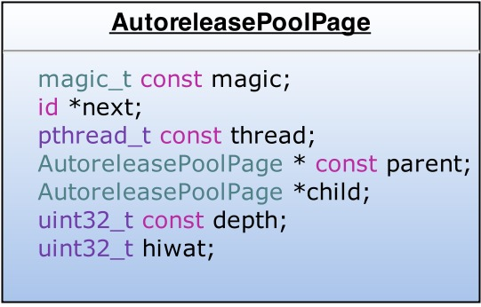
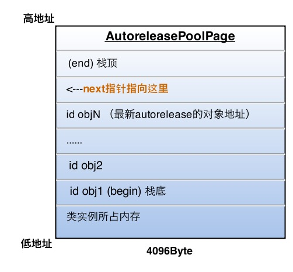
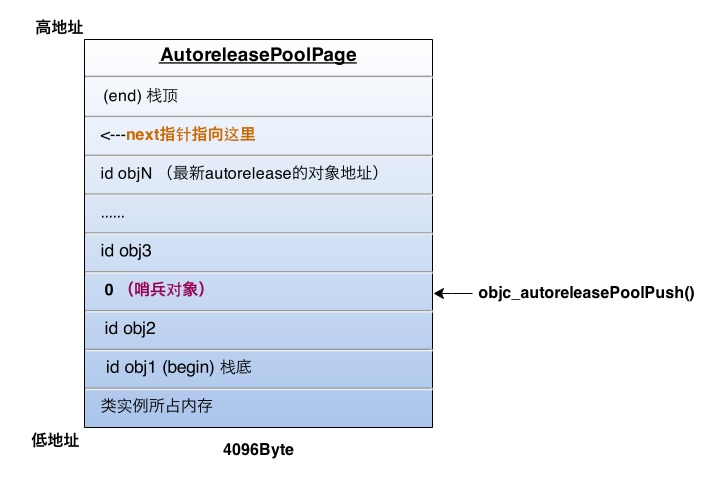
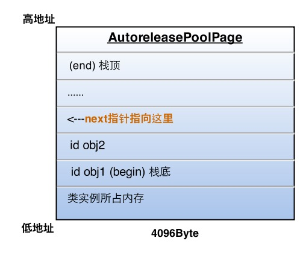

# AutoreleasePool

## Autorelease对象什么时候释放

[http://blog.sunnyxx.com/2014/10/15/behind-autorelease/](http://blog.sunnyxx.com/2014/10/15/behind-autorelease/)

| 添加AutoreleasePool的类型 | 释放时机 | 原因 |
| :--- | :--- | :--- |
| 系统默认的AutoreleasePool | 在当前runloop迭代结束的时候释放 | 系统在每个runloop迭代中都加入了自动释放池Push和Pop |
| 手动添加的AutoreleasePool | 在超出作用域的时候释放（也就是大括号外面） |  |

## AutoreleasePool原理

```objectivec
@autoreleasepool{}

// 编译后：
void *context = objc_autoreleasePoolPush();
// {}中的代码
objc_autoreleasePoolPop(context);
```

以上的两个函数都是对`AutoreleasePoolPage`这个类的封装.

> #### `AutoreleasePoolPage`是一个C++实现的类，具体结构如下：



* 是一个双向的链表
* AutoreleasePoolPage每个对象会开辟4096字节内存（等于虚拟内存一页的大小，6s之前前，一页虚拟内存的大小是4k，6s（包含）之后，一页虚拟内存的大小是16k），除了实例变量所占的内存，其余的内存空间全部留给autorealse对象
* AutoreleasePool是按线程一一对应的，结构体中的`thread`就是指当前的线程
* 结构体中的`next`就是下一个加进来的autorelease对象的位置
* 一个AutoreleasePoolPage对象被占满时，就会新建新的AutoreleasePoolPage对象，然后链表连接，后面的autorelease对象就加入新的page里面去

> #### Autorelease对象在AutoreleasePool中的存放示意图：



* 当向一个对象发送`autorelease`消息的时候，就是把对象添加到next指针所在的位置

> #### 释放时机

每次调用objc\_autoreleasePoolPush的时候，runtime就会往当前的AutoreleasePoolPage中添加一个哨兵对象（POOL\_BOUNDARY），值等于0，然后AutoreleasePoolPage的内部结构如下所示：



objc\_autoreleasePoolPush的返回值就是哨兵对象的地址，objc\_autoreleasePoolPop的参数就是哨兵对象（POOL\_BOUNDARY）的地址，所以：

1. 将入参的哨兵对象（POOL\_BOUNDARY）地址找到对对应的page
2. 在当前page中，将晚于哨兵对象（POOL\_BOUNDARY）加入的autorelease对象发送一次release消息，并把next指针移回正确的位置
3. 从最新加入的autorelease对象一直向前清理，可以跨越多个page，直到清理到哨兵对象所在的位置

> #### objc\_autoreleasePoolPop调用之后，AutoreleasePoolPage的内部结构如下：



## 子线程中的AutoreleasePool

> #### 子线程没有开启RunLoop的情况下，什么时候释放

* 子线程退出的时候
* 局部 autoreleasepool drain的时候

> #### 子线程默认不会开启 Runloop，那出现 Autorelease 对象如何处理？不手动处理会内存泄漏吗？
>
> 参考：[https://stackoverflow.com/questions/24952549/does-nsthread-create-autoreleasepool-automatically-now](https://stackoverflow.com/questions/24952549/does-nsthread-create-autoreleasepool-automatically-now)

* 子线程创建了 AutoreleasePool 的话，产生的 Autorelease 对象就会交给 AutoreleasePool 去管理。
* 如果没有创建 AutoreleasePool，但是产生了 Autorelease 对象，就会调用 autoreleaseNoPage 方法。这个方法会自动帮你创建一个 hotpage，并调用 page-&gt;add\(obj\)将对象添加到 AutoreleasePoolPage 的栈中，也就是说不进行手动的内存管理，也不会内存泄漏。

## 什么对象会自动加入 AutoReleasePool 中

* 当使用`alloc/new/copy/mutableCopy`开始的方法进行初始化时，会生成并持有对象，**`不会`**添加到 AutoReleasePool 中
* `id`的指针或对象的指针在没有显式指定时会被附加上`__autorealeasing`修饰符

```objectivec
+ (nullable instancetype)stringWithContentsOfURL:(NSURL *)url
                                        encoding:(NSStringEncoding)enc
                                           error:(NSError **)error;

// 等价于                                            
NSString *str = [NSString stringWithContentsOfURL:
                                         encoding:
                                            error:<#(NSError * _Nullable __autoreleasing * _Nullable)#>]
```


