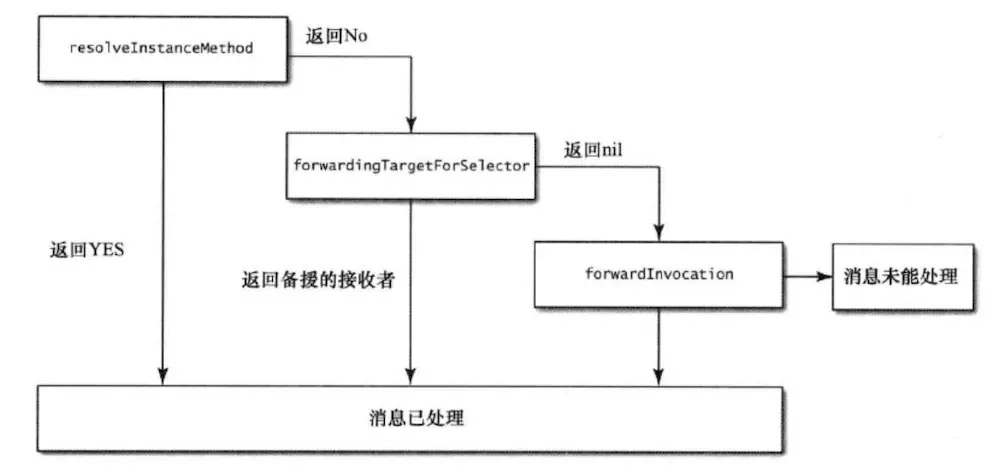

# Runtime

> ## 相关链接

[http://yulingtianxia.com/blog/2014/11/05/objective-c-runtime/](./#httpyulingtianxiacomblog20141105objective-c-runtime)

> ## 什么是runtime

* OC是一门动态性比较强的编程语言，允许很多操作推迟到程序运行时在进行
* OC的动态性就是由runtime来支撑和实现的，runtime是一套C语言的API，封装了很多动态性相关的函数
* 平时编写的OC代码，底层都是转换成runtime api进行调用

> ## 什么是isa

* 在arm64架构之前，isa是一个普通的指针，存储着Class，meta-class对象的内存地址
* 在arm64架构开始，对isa进行了优化，变成了一个共同体（union）结构，还使用了位域来存储更多的信息
* isa arm64结构如下：

```objectivec
// 一共64位，8个字节
union isa_t 
{
    Class cls;
    uintptr_t bits;

# if __arm64__
#   define ISA_MASK        0x0000000ffffffff8ULL
#   define ISA_MAGIC_MASK  0x000003f000000001ULL
#   define ISA_MAGIC_VALUE 0x000001a000000001ULL
    struct {

        // 0: 表示普通的指针，存储着class，meta-class对象的内存地址；
        // 1: 表示优化过，使用位域存储信息
        uintptr_t nonpointer        : 1; 

        // 曾经是否设置过关联对象
        uintptr_t has_assoc         : 1; 

        // 是否有C++的析构函数（.cxx_destruct）
        uintptr_t has_cxx_dtor      : 1;

        // 存储着class，meta-class对象的内存地址信息
        // amr64架构，需要用isa & ISA_MASK 才能拿到正确的class，meta-class对象的内存地址
        uintptr_t shiftcls          : 33; 

        // 在调试时分辨对象是否未完成初始化
        uintptr_t magic             : 6;

        // 曾经是否有被弱引用过
        uintptr_t weakly_referenced : 1;

        // 对象是否正在释放
        uintptr_t deallocating      : 1;

        // 引用计数器是否过大无法存储在isa中
        // 如果为1，那么引用计数会存储在一个叫sideTable的类的属性中
        uintptr_t has_sidetable_rc  : 1;

        // 存储引用计数的值减1 
        uintptr_t extra_rc          : 19;
    };
};
```

> ## super的本质

super调用，底层会转换为`objc_msgSendSuper2`函数调用，接收2个参数：

* struct objc\_super2
* SEL

```objectivec
struct objc_super2 {
    id receiver; // 消息接受者
    Class current_class; // receiver的Class对象，在通过current_class->superClass，在父类开始查找方法
};
```

> ## 类的数据结构

```objectivec
struct objc_class : objc_object {
    Class isa;
    Class superclass;
    cache_t cache; // 方法缓存
    class_data_bits_t bits; // 用于获取具体的类信息
};

// 通过上面的 `bits & FAST_DATA_MASK` 来获取这个结构体
// 里面的methods，properties，protocols是二维数组，里面包含了类的初始内容和分类的内容
struct class_rw_t {
    uint32_t flags;
    uint32_t version;
    const class_ro_t *ro; // 类的最初的信息
    method_array_t methods; // 方法列表，类本身+分类的方法列表
    property_array_t properties; // 属性列表
    protocol_array_t protocols; // 协议列表
    Class firstSubclass;
    Class nextSiblingClass;
    char *demangledName;
};

// 里面的baseMethodList，baseProtocols，baseProperties，ivars是一维数组，里面包含了类的初始内容
struct class_ro_t {
    uint32_t flags;
    uint32_t instanceStart;
    uint32_t instanceSize; // instance对象占用的内存空间
#ifdef __LP64__
    uint32_t reserved;
#endif

    const uint8_t * ivarLayout;
    const char * name; // 类名
    method_list_t * baseMethodList;
    protocol_list_t * baseProtocols;
    const ivar_list_t * ivars; // 成员变量列表
    const uint8_t * weakIvarLayout;
    property_list_t *baseProperties;
    method_list_t *baseMethods() const {
        return baseMethodList;
    }
};
```

> ## 类的实例的数据结构

```objectivec
// Represents an instance of a class.
struct objc_object {
    Class isa  OBJC_ISA_AVAILABILITY;
};
```

> ## 成员变量的数据结构

```objectivec
struct objc_ivar {
    char *ivar_name OBJC2_UNAVAILABLE; // 变量名。
    char *ivar_type OBJC2_UNAVAILABLE; // 变量类型。
    int ivar_offset OBJC2_UNAVAILABLE; // 基地址偏移量，在对成员变量寻址时使用。
#ifdef __LP64__
    int space OBJC2_UNAVAILABLE;
#endif
}
```

> ## 属性的数据结构

```objectivec
struct property_t {
    const char *name; // property的名称
    const char *attributes; // 对应下面的结构体
};

// attributes 对应的结构体
typedef struct {
    const char *name; // 属性的类型，T@"NSString"
    const char *value; // 原子性、内存语义和对应的实例变量，C,N,V_string
} objc_property_attribute_t;
```

属性大致生成了五个东西：

* OBJC_IVAR_$类名$属性名称 ：该属性的“偏移量” \(offset\)，这个偏移量是“硬编码” \(hardcode\)，表示该变量距离存放对象的内存区域的起始地址有多远。
* setter 与 getter 方法对应的实现函数
* ivar\_list ：成员变量列表
* method\_list ：方法列表
* prop\_list ：属性列表

也就是说我们每次在增加一个属性,系统都会在 ivar\_list 中添加一个成员变量的描述, 在 method\_list 中增加 setter 与 getter 方法的描述,在属性列表中增加一个属性的描述, 然后计算该属性在对象中的偏移量,然后给出 setter 与 getter 方法对应的实现, 在 setter 方法中从偏移量的位置开始赋值,在 getter 方法中从偏移量开始取值, 为了能够读取正确字节数, 系统对象偏移量的指针类型进行了类型强转.

> ## 方法的数据结构

```objectivec
typedef struct objc_method *Method;

struct objc_method {
    SEL method_name OBJC2_UNAVAILABLE; // 函数名
    char *method_types OBJC2_UNAVAILABLE; // 编码（返回值类型，参数类型）
    IMP method_imp OBJC2_UNAVAILABLE; // 指向函数的指针（函数地址）
} OBJC2_UNAVAILABLE;
```

`i24 @0 :8 i16 f20`解释：

* `i24`: 表示返回值是int类型，总共占用24位
* `@0`: 表示隐藏参数self，在第0位开始
* `:8`: 表示SEL，在第8位开始
* `i16`: 表示第1参数是int类型，在第16位开始
* `f20`: 表示第2参数是float类型，在第20位开始

> ## 方法缓存的数据结构

* 方法缓存**保存**步骤：
  * 通过 `@selector（myFunction）& _mask` 计算得出一个数组下标
  * 如果对应下标的位置没有存储过数据，就直接保存进去
  * 如果计算出来的下标对应的位置已经有存储的数据，就按照`下标-1`的方式循环往上寻找，直到找到空位保存进去
* 方法缓存**取值**步骤：
  * 通过 `@selector（myFunction）& _mask` 计算得出一个数组下标
  * 在对应的下标获取数据，然后判断取出来的SEL进行对比，
  * 如果不是目标的SEL，就按照`下标-1`的方式循环往上寻找，直到找到目标SEL然后取出对应的IMP
* 方法缓存散列表扩容：
  * 一开始开辟的空间比较小，在缓存列表满之后，会按照`旧容量*2`的方式进行扩容，同时还会把散列表里面的数据清空

```objectivec
struct cache_t {
    struct bucket_t *_buckets; // 散列表（哈希表）
    mask_t _mask; // 散列表的长度 - 1
    mask_t _occupied; // 已经缓存的方法数量
};

struct bucket_t {
    cache_key_t _key; // SEL作为KEY
    IMP _imp; // 函数的内存地址
};
```

> ## 消息发送`objc_msgSend`流程

```objectivec
objc_msgSend(receiver, selector, arg1, arg2, ...)
```

`objc_msgSend(obj,foo)`解释：

将foo消息发送给obj对象，首先在 Class 中的缓存查找 IMP （没缓存则初始化缓存），如果没找到，则向父类的 Class 查找。如果一直查找到根类仍旧没有实现，则用\_objc\_msgForward函数指针代替 IMP 。最后执行这个 IMP ，走消息转发流程

**详细流程如下：**

* 判断receiver（obj）是否为nil
* 如果是YES，就退出
* 如果是NO，查找的顺序如下：
  * 从receiverClass（obj的class）的cache中查找方法，找到就调用方法，查找流程结束
  * 从receiverClass（obj的class）的`~class_rw_t`中查找方法，找到就调用方法同时把方法缓存到receiverClass（obj的class）的cache中，查找流程结束
  * 从superClass的cache中查找方法，找到就调用方法同时把方法缓存到receiverClass（obj的class）的cache中，查找流程结束
  * 从superClass的`~class_rw_t`中查找方法，找到就调用方法同时把方法缓存到receiverClass（obj的class）的cache中，查找流程结束
* 在`class_rw_t`中查找方法的顺序
  * 对于已经排序好的，使用二分法查找
  * 没有排序的，就线性查找（遍历查找）
* receiver通过isa指针找到receiverClass
* receiverClass通过superclass指针找到SuperClass

> ## 消息转发流程



* 动态方法解析
  * 根据消息的接受者类型分别调用对应的方法：`resolveInstanceMethod`（实例对象） 和 `resolveClassMethod`（类对象）
  * 在调用完上面的方法之后，就标记为**已经动态解析**，然后重新来一次消息发送的流程，就是【缓存 - 方法表 - 父类缓存 - 父类方法表】的流程再来一次查找
  * 上面两个方法的返回值，无论是YES还是NO都没什么用，因为在知道走到了这两个方法，外部就会自动标示为**已经动态解析**
* 快速转发

  `forwardingTargetForSelector`

* 完整转发

  `methodSignatureForSelector` 和 `forwardInvocation`

> ## isa和superclass


- instance的isa指向class
- class的isa指向meta-class
- meta-class的isa指向基类的meta-class
- class的superclass指向父类的class
    - 如果没有父类，superclass指针为nil
- meta-class的superclass指向父类的meta-class
    - 基类的meta-class的superclass指向基类的class
    

