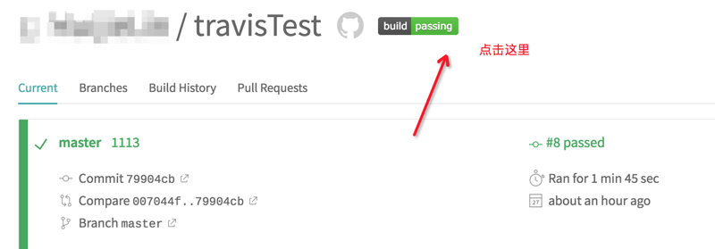

简介

---

Travis CI 是持续集成服务，它可以跟github上面的仓库做关联，每当仓库代码有改动时就会自动构建和编译。

> 官网

[https://travis-ci.org/](https://travis-ci.org/)

## 操作步骤

---

* 登录官网，使用Github账号登录

* 选择需要关联的仓库，直接『打勾』即可

* 在仓库的根目录加入命名为`.travis.yml`的文件，不用语言的构建方式可以参考 [https://docs.travis-ci.com/ ](https://docs.travis-ci.com/)的`Programming Languages`

* 在编写完`.travis.yml`文件后，整个过程就已经完成。日后关联的仓库在有代码更新时就会自动构建和编译。

## 日常应用

---

* #### Objective-C `.travis.yml` 文件编写例子

> 参考连接 [https://docs.travis-ci.com/user/languages/objective-c/](#)

```objectivec
language: objective-c // 要编译的语言
osx_image: xcode10.1 // 要编译的环境，默认9.4
xcode_workspace: TravisTest.xcworkspace
xcode_scheme: TravisTest // 需要编译的schema，需要提前设置成shared
xcode_sdk: iphonesimulator12.1 // 运行的模拟器版本
podfile: Podfile // cocoaPods podfile文件的路径

before_install:
  - pod repo update // 由于在运行的时候Travis直接运行的是pod install，所以会导致有一些库版本搜索不到，所以要预先添加这个操作
```

* #### 在仓库首页的README中显示Travis的运行结果图标

  * 找到Travis对应仓库，点击结果图标

  

  * 复制对应连接

  

  * 粘贴在仓库的README中

  

## 错误排查

---

> xcodebuild: error: Scheme YOUR\_SCHEME is not currently configured for the test action
>
> 参考连接：[https://stackoverflow.com/questions/30481630/scheme-is-not-configured-for-the-test-action-ios-xcode-project](https://stackoverflow.com/questions/30481630/scheme-is-not-configured-for-the-test-action-ios-xcode-project)

* 如果你的项目是一个framework，可以设置edit scheme -&gt; Run -&gt; Executable 选择『Ask on Launch』

* 如果你的项目是一个Application

  * 可以设置edit scheme -&gt; Run -&gt; Executable 选择『对应的scheme即可』
  * 如果还是不行可以通过 `xcodebuild -workspace path/to/workspace/file -list` 或者 `xcodebuild -project path/to/project/file -list` 查看有没有重复的scheme进行删除

|  |  |
| :--- | ---: |
|  |  |
|  |  |
|  |  |
|  |  |
|  |  |
|  |  |


